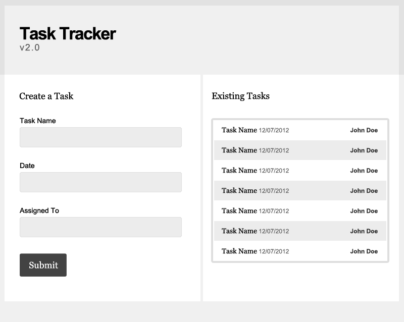

Task Tracker v2.0
=================
> A programming exercise to recreate the described SPA.

Requirements
------------
- [x] Should load the data below into the existing data section on page load.
- [x] Should have the ability to create tasks that will immediately be prepended to the list.
- [x] Should not require a web server, and should be able to run offline.
- [x] Match the design as close as possible.
- [x] All data exchanges should be in JSON format.
- [x] Must be completed using jQuery or vanilla JavaScript

Existing Data (JSON)
--------------------
```json
[
    {"name": "Test Task #1", "date": "12/01/2012", "assigned": "John Doe" },
    {"name": "Test Task #2", "date": "12/02/2012", "assigned": "John Doe" },
    {"name": "Test Task #3", "date": "12/03/2012", "assigned": "John Doe" },
    {"name": "Test Task #4", "date": "12/04/2012", "assigned": "John Doe" },
    {"name": "Test Task #5", "date": "12/05/2012", "assigned": "John Doe" },
    {"name": "Test Task #6", "date": "12/06/2012", "assigned": "John Doe" },
    {"name": "Test Task #7", "date": "12/07/2012", "assigned": "John Doe" }
]
```

Design
------


License
-------
The MIT License (Expat). See the [license file](LICENSE) for details.
